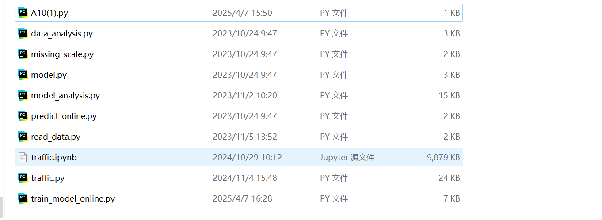

# python代码文件功能讲解



## 文件名解释

这些文件构成了一个完整的数据处理、模型训练和预测系统，以下是它们的调用顺序：

1. **`A10(1).py`：** 主程序，负责调用其他模块完成整个流程
2. **`read_data.py`：** 读取和清洗数据
3. **`missing_scale.py`：** 处理缺失值和标准化数据
4. **`model.py`：** 训练深度神经网络模型
5. **`data_analysis.py`：** 对数据进行可视化分析
6. **`predict_online.py`：** 加载模型并进行在线预测
7. **`model_analysis.py`：** 对不同模型进行性能比较和分析
8. **`traffic.py`：** 对交通数据进行可视化分析
9. **`train_model_online.py`：** 在线训练和保存模型

## 1. `A10(1).py`

**文件名翻译：** 主程序文件
**功能：**
这是整个项目的主程序文件，负责调用其他模块完成数据读取、预处理、模型训练和保存等任务

### 主要功能：

- **读取训练数据和验证数据：** 使用`read_data`模块读取训练数据和验证数据
- **数据清洗：** 调用`remove_duplicates`函数删除重复值
- **缺失值处理：** 调用`fill_missing_values`函数填充缺失值
- **数据标准化：** 调用`scale_data`函数对数据进行标准化
- **模型训练：** 调用`train_model`函数训练模型并保存训练好的模型

```python
from model import train_model
from read_data import read_data, remove_duplicates
from missing_scale import fill_missing_values, scale_data

# 导入文件
file_path_train = './data/train_10000.csv'
file_path_val = './data/validate_1000.csv'

df, y = read_data(file_path_train)
df_val, y_val = read_data(file_path_val)

# 删除重复值
df, y = remove_duplicates(df, y)

# 填充缺失值
df = fill_missing_values(df)
df_val = fill_missing_values(df_val)

# 标准化数据集
df = scale_data(df)
df_val = scale_data(df_val)

# 模型训练
model_name = train_model(df, y, df_val, y_val)
```

## 2. `read_data.py`

**文件名翻译：** 数据读取模块
**功能：**
负责读取数据文件并进行初步处理，包括删除重复值和无用特征

### 主要功能：

- **读取CSV文件：** 使用`pd.read_csv`读取CSV文件
- **删除重复值：** 使用`drop_duplicates`函数删除重复值
- **删除无用特征：** 使用`drop_features`函数删除无用特征列

Python复制

```python
import pandas as pd

def read_data(train_file_path, val_file_path=None):
    df_train = pd.read_csv(train_file_path, index_col="sample_id")
    if 'label' in df_train.columns:
        y_train = df_train['label'].copy()
    else:
        y_train = None
    if val_file_path:
        df_val = pd.read_csv(val_file_path, index_col="sample_id")
        if 'label' in df_val.columns:
            y_val = df_val['label'].copy()
        else:
            y_val = None
        return df_train, y_train, df_val, y_val
    else:
        return df_train, y_train

def remove_duplicates(data, y):
    data = data.drop_duplicates()
    y = y.loc[data.index]
    return data, y

def drop_features(data):
    features_to_drop = ['feature57', 'feature77', 'feature100', 'feature92', 'feature88', 'feature65', 'feature54'
                        , 'feature80', 'feature1', 'feature60', 'feature32', 'feature78', 'feature20', 'feature3'
                        , 'feature11', 'feature23', 'feature34', 'feature40', 'feature42', 'feature58']
    data = data.drop(features_to_drop, axis=1)
    return data
```

## 3. `missing_scale.py`

**文件名翻译：** 缺失值处理和数据标准化模块
**功能：**
负责处理数据中的缺失值并进行标准化。

### 主要功能：

- **缺失值填充：** 根据数据集大小选择不同的填充方法。

- **数据标准化：** 使用`StandardScaler`对数据进行标准化

  ~`StandardScaler`是一种常用的数据预处理工具，它可以帮助我们对数据进行标准化处理。简单来说，它就是把数据调整到一个统一的尺度上，让不同特征的数据在同一个“起跑线”上进行比较和分析~

  ^~具体来说，`StandardScaler`会计算每个特征的平均值和标准差，然后将每个数据点减去平均值，再除以标准差。这样处理后，数据的平均值会变成0，标准差会变成1。这样，无论原始数据的尺度如何，经过`StandardScaler`处理后，数据都会在一个相对统一的尺度上，便于后续的分析和建模。~^

```python
import pandas as pd
from sklearn.discriminant_analysis import StandardScaler
from sklearn.impute import KNNImputer, SimpleImputer

def fill_missing_values(data):
    if 'label' in data.columns:
        data = data.drop('label', axis=1)
    if len(data) < 100:
        data = data.fillna(0)
    elif len(data) >= 100 and len(data) < 500:
        imputer = SimpleImputer(strategy='mean')
        data_filled = imputer.fit_transform(data)
        data = pd.DataFrame(data_filled, columns=data.columns, index=data.index)
    else:
        imputer = KNNImputer(n_neighbors=42, weights='distance')
        data_filled = imputer.fit_transform(data)
        data = pd.DataFrame(data_filled, columns=data.columns, index=data.index)
    return data

def scale_data(data):
    scaler = StandardScaler()
    data = pd.DataFrame(scaler.fit_transform(data), columns=data.columns)
    return data
```

## 4. `model.py`

**文件名翻译：** 模型训练模块
**功能：**
负责构建和训练深度神经网络模型。

### 主要功能：

- **模型构建：** 使用`Sequential`构建多层神经网络模型。

- **模型编译：** 使用`compile`方法编译模型，选择优化器和损失函数。

- **模型训练：** 使用`fit`方法训练模型。

- **模型评估：** 使用混淆矩阵和分类报告评估模型性能

  ```
  混淆矩阵
  混淆矩阵就像一个成绩单，它能告诉我们模型在每个类别上的表现。比如，我们有一个模型来判断图片里是猫还是狗。混淆矩阵会告诉我们：
  模型说“猫”的时候，实际是猫的有多少张（真正例）
  模型说“猫”的时候，实际是狗的有多少张（假正例）
  模型说“狗”的时候，实际是狗的有多少张（真负例）
  模型说“狗”的时候，实际是猫的有多少张（假负例）
  分类报告
  分类报告则是更详细的“成绩单”，它会告诉我们：
  精确率（Precision）： 模型说对了的比例。比如，模型说“猫”的时候，有多少次是真的猫。
  召回率（Recall）： 实际是猫的图片，模型正确识别出来的比例。
  F1值（F1 Score）： 精确率和召回率的综合评分，用来衡量模型的整体表现
  ```

  

- **模型保存：** 将训练好的模型保存到文件中

  

```python
import numpy as np
import datetime
import seaborn as sns
import matplotlib.pyplot as plt
from keras.regularizers import l1, l2
from sklearn.metrics import classification_report, confusion_matrix
from tensorflow.keras.models import Sequential
from tensorflow.keras.layers import Dense
from keras.utils import to_categorical
from sklearn.model_selection import train_test_split
from sklearn.utils import compute_class_weight

def train_model(X_train, y_train, X_val=None, y_val=None):
    if X_val is None or y_val is None:
        X_train, X_val, y_train, y_val = train_test_split(X_train, y_train, test_size=0.2)
    class_weights = compute_class_weight(class_weight='balanced', classes=np.unique(y_train), y=y_train)
    class_weights = dict(enumerate(class_weights))
    model = Sequential()
    model.add(Dense(94, activation='tanh', input_shape=(X_train.shape[1],), kernel_regularizer=l1(0.01)))
    model.add(Dense(282, activation='tanh', kernel_regularizer=l2(0.01)))
    model.add(Dense(252, activation='tanh', kernel_regularizer=l2(0.01)))
    model.add(Dense(42, activation='tanh', kernel_regularizer=l2(0.01)))
    model.add(Dense(6, activation='softmax'))
    model.compile(loss='categorical_crossentropy', optimizer='Adamax', metrics=['accuracy'])
    y_train = to_categorical(y_train)
    y_val = to_categorical(y_val)
    history = model.fit(X_train, y_train, epochs=312, batch_size=1234, class_weight=class_weights, validation_data=(X_val, y_val))
    plt.plot(history.history['loss'])
    plt.plot(history.history['val_loss'])
    plt.title('Model loss')
    plt.ylabel('Loss')
    plt.xlabel('Epoch')
    plt.legend(['Train', 'Validation'], loc='upper right')
    plt.show()
    plt.plot(history.history['accuracy'])
    plt.plot(history.history['val_accuracy'])
    plt.title('Model accuracy')
    plt.ylabel('Accuracy')
    plt.xlabel('Epoch')
    plt.legend(['Train', 'Validation'], loc='lower right')
    plt.show()
    y_pred = model.predict(X_val)
    y_pred = y_pred.argmax(axis=1)
    y_true = y_val.argmax(axis=1)
    print(classification_report(y_true, y_pred))
    cm = confusion_matrix(y_true, y_pred)
    sns.heatmap(cm, annot=True, fmt='d', cmap='Blues')
    plt.xlabel('预测标签')
    plt.ylabel('真实标签')
    plt.show()
    timestamp = datetime.datetime.now().strftime("%Y%m%d_%H%M%S")
    model_name = f"dnn_model_{timestamp}.h5"
    model.save(model_name)
    return model_name
```

## 5. `data_analysis.py`

**文件名翻译：** 数据分析模块
**功能：**
负责对数据进行可视化分析，包括类别分布、特征概率密度图等。

### 主要功能：

- **类别分布图：** 使用`countplot`绘制类别分布图

- **概率密度图：** 使用`kdeplot`绘制特征的概率密度图

- **相关性矩阵：** 使用`heatmap`绘制特征之间的相关性矩阵

  ```
  1. 类别分布图（countplot）
  就像统计全班同学的兴趣班报名人数。
  
  作用：直接数每个类别有多少人（比如舞蹈班30人，篮球班20人，编程班15人）
  
  为什么用：如果发现某个类别特别少（比如编程班柱子特别矮），可能数据不平衡，训练模型会偏科
  
  常见翻车：如果类别太多（比如20个兴趣班），柱子会挤成一排根本看不清 → 要合并小类或旋转标签
  
  2. 概率密度图（kdeplot）
  像把全班身高数据倒在地上，看堆出来的小山包形状
  
  作用：一眼看出数据是平缓的大土坡（数据分散）还是尖尖的富士山（数据集中）
  
  为什么用：
  
  发现奇怪形状：比如本该是单峰的身高数据出现双峰 → 可能混入了男女两个群体没分开
  
  看到异常值：曲线最右边有个小尾巴 → 可能有身高2米3的异常同学
  
  3. 相关性矩阵（heatmap）
  各科成绩的"CP感"地图
  
  作用：找哪两门课成绩总是一起涨跌（比如数学物理经常红彤彤正相关，数学语文可能浅蓝色负相关）
  
  为什么用：
  
  发现冗余特征：如果数学和物理相关性0.95 → 可能只需要保留一科成绩
  
  找预测线索：如果历史成绩和地理成绩强相关 → 可能共享某种学习逻辑
  
  注意：颜色特别深的格子要警惕！可能是特征有公式关联（比如BMI=体重/身高²，自然和体重强相关
  ```

  

```python
import warnings
import pandas as pd
import random
import seaborn as sns
from matplotlib import pyplot as plt
from tensorflow.keras.models import load_model
import json
import pymysql

def data_analysis(data, y):
    sns.set(style="darkgrid")
    plt.rcParams['axes.unicode_minus'] = False
    plt.rcParams['font.family'] = ['SimHei']
    ax = sns.countplot(x=y)
    ax.set_title('故障分布')
    plt.xlabel('类别')
    plt.ylabel('个数')
    plt.show()
    data = data.drop(y.name, axis=1)
    features = data.columns
    plot_features = random.sample(list(features), k=1)
    for feature in plot_features:
        data = data.reset_index(drop=True)
        sns.kdeplot(data[feature], fill=True)
        plt.title(f'{feature} 概率密度函数')
        plt.xlabel(feature)
        plt.ylabel('概率密度')
        plt.show()
    data = pd.concat([data, y], axis=1)
```

## 6. `predict_online.py`

**文件名翻译：** 在线预测模块
**功能：**
负责加载训练好的模型并进行在线预测

### 主要功能：

- **模型加载：** 使用`load_model`加载训练好的模型
- **预测：** 使用`predict`方法进行预测
- **结果保存：** 将预测结果保存为JSON文件

```python
import uuid
from data_analysis import predict
from read_data import read_data, drop_features
from missing_scale import fill_missing_values, scale_data
import sys
import os

predict_file_path = sys.argv[1]
output_predict_file_name = sys.argv[2]
predict_model_file = sys.argv[3]

data, y = read_data(predict_file_path)
data = drop_features(data)
data = fill_missing_values(data)
data = scale_data(data)

predict(predict_model_file, data, output_predict_file_name, predict_file_path)
```

## 7. `model_analysis.py`

**文件名翻译：** 模型分析模块
**功能：**
负责对不同模型（如FNN、DT、RF）进行训练和性能比较，并生成分析报告

```
不同模型（如FNN、DT、RF）：
FNN（前馈神经网络）： 这是一种复杂的数学模型，就像一个有很多层的“数学公式”，可以用来学习数据中的复杂规律。
DT（决策树）： 这是一种简单的模型，就像一个“如果-那么”的规则集合，通过分支结构来判断结果。
RF（随机森林）： 这是一个由多个决策树组成的模型，通过“投票”来决定最终结果，通常比单个决策树更准确。
训练模型：
我们用数据来“教”这些模型，让它们学会如何根据输入（比如图片、数值）来预测输出（比如分类结果）。
性能比较：
我们用一些指标（比如准确率、F1值）来评估每个模型的表现，看看哪个模型更准确、更可靠。
生成分析报告：
最后，我们会生成一份报告，总结每个模型的表现，帮助我们选择最适合的模型。
```


### 主要功能：

- **模型训练：** 训练多种模型（如前馈神经网络、决策树、随机森林）
- **模型比较：** 使用柱状图比较不同模型的准确率和F1值
- **报告生成：** 生成详细的分类报告并保存为文档

```python
from read_data import read_data, remove_duplicates, drop_features
from missing_scale import fill_missing_values, scale_data
from keras.utils import to_categorical
from sklearn.model_selection import train_test_split
from sklearn.utils import compute_class_weight
from sklearn.tree import DecisionTreeClassifier
from sklearn.model_selection import GridSearchCV
from sklearn.metrics import accuracy_score, f1_score
import joblib
from sklearn.ensemble import RandomForestClassifier
from keras.regularizers import l1, l2
from sklearn.metrics import classification_report
from tensorflow.keras.models import Sequential
from tensorflow.keras.layers import Dense
import numpy as np
import datetime
import sys
import docx
from docx import Document
from docx.enum.text import WD_ALIGN_PARAGRAPH
from docx.enum.table import WD_TABLE_ALIGNMENT
from docx.shared import Inches
import matplotlib.pyplot as plt

def train_model_online(X_train, y_train, model_type, X_val=None, y_val=None):
    if X_val is None or y_val is None:
        X_train, X_val, y_train, y_val = train_test_split(X_train, y_train, test_size=0.2)
    class_weights = compute_class_weight(class_weight='balanced', classes=np.unique(y_train), y=y_train)
    class_weights = dict(enumerate(class_weights))
    model = None
    if model_type == 'modelFNN':
        model = Sequential()
        model.add(Dense(94, activation='tanh', input_shape=(X_train.shape[1],), kernel_regularizer=l1(0.01)))
        model.add(Dense(282, activation='tanh', kernel_regularizer=l2(0.01)))
        model.add(Dense(252, activation='tanh', kernel_regularizer=l2(0.01)))
        model.add(Dense(42, activation='tanh', kernel_regularizer=l2(0.01)))
        model.add(Dense(6, activation='softmax'))
        model.compile(loss='categorical_crossentropy', optimizer='Adamax', metrics=['accuracy'])
        y_train = to_categorical(y_train)
        y_val = to_categorical(y_val)
        history = model.fit(X_train, y_train, epochs=54, batch_size=632, class_weight=class_weights, validation_data=(X_val, y_val))
        y_pred = model.predict(X_val)
        y_pred = y_pred.argmax(axis=1)
        y_true = y_val.argmax(axis=1)
        print(classification_report(y_true, y_pred))
        model.save(sys.argv[2])
    # 其他模型类型（如DT、RF）的代码类似，此处省略
    return sys.argv[2]
```

## 8. `traffic.py`

**文件名翻译：** 交通数据分析模块，详情请见<!--交通数据分析代码详解(自编)-->

**功能：**
负责对交通数据进行可视化分析，包括车辆计数分布、交通状况分布等

### 主要功能：

- **车辆计数分布：** 使用`histogram`绘制车辆计数分布图。
- **交通状况分布：** 使用`pie`绘制交通状况分布图。
- **流量变化分析：** 可视化不同时间段的交通流量变化。

```python
import sys
import pandas as pd
import matplotlib.pyplot as plt
import plotly.express as px
import plotly.graph_objects as go
from plotly.subplots import make_subplots
import seaborn as sns
from scipy.stats import shapiro
from sklearn.preprocessing import QuantileTransformer, StandardScaler, OneHotEncoder, LabelEncoder
from sklearn.model_selection import train_test_split
from sklearn.ensemble import RandomForestClassifier
from sklearn.metrics import classification_report, accuracy_score
from sklearn.compose import ColumnTransformer
from sklearn.pipeline import Pipeline

input_train_filepath = sys.argv[1]
traffic_df = pd.read_csv(input_train_filepath)
traffic_two_month_df = pd.read_csv(input_train_filepath)

traffic_df['Source'] = 'OneMonth'
traffic_two_month_df['Source'] = 'TwoMonth'
combined_df = pd.concat([traffic_df, traffic_two_month_df], ignore_index=True)

fig = make_subplots(rows=2, cols=2, subplot_titles=("Car Counts", "Bike Counts", "Bus Counts", "Truck Counts"))
fig.add_trace(go.Histogram(x=combined_df['CarCount'], name='Car Counts', marker_color='#1f77b4'), row=1, col=1)
fig.add_trace(go.Histogram(x=combined_df['BikeCount'], name='Bike Counts', marker_color='#ff7f0e'), row=1, col=2)
fig.add_trace(go.Histogram(x=combined_df['BusCount'], name='Bus Counts', marker_color='#2ca02c'), row=2, col=1)
fig.add_trace(go.Histogram(x=combined_df['TruckCount'], name='Truck Counts', marker_color='#d62728'), row=2, col=2)
fig.update_layout(title_text='Distribution of Vehicle Counts', title_x=0.5, showlegend=False, template='plotly_white')
fig.update_xaxes(title_text="Count")
fig.update_yaxes(title_text="Frequency")
fig.show()
```

## 9. `train_model_online.py`

**文件名翻译：** 在线模型训练模块
**功能：**
负责在线训练模型并保存训练好的模型

### 主要功能：

- **模型选择：** 根据输入的模型类型选择不同的模型进行训练。
- **参数优化：** 使用网格搜索优化模型参数。
- **模型保存：** 保存训练好的模型。

```python
from read_data import read_data, remove_duplicates, drop_features
from missing_scale import fill_missing_values, scale_data
from keras.utils import to_categorical
from sklearn.model_selection import train_test_split
from sklearn.utils import compute_class_weight
from sklearn.tree import DecisionTreeClassifier
from sklearn.model_selection import GridSearchCV
import joblib
from sklearn.ensemble import RandomForestClassifier
from keras.regularizers import l1, l2
from sklearn.metrics import classification_report
from tensorflow.keras.models import Sequential
from tensorflow.keras.layers import Dense
import numpy as np
import datetime
import sys

input_train_filepath = sys.argv[1]
model_type = sys.argv[3]

data = read_data(input_train_filepath)
if len(data) == 4:
    df_train, y_train, df_val, y_val = data
    df_train, y_train = remove_duplicates(df_train, y_train)
    df_val = drop_features(df_val)
    df_val = fill_missing_values(df_val)
    df_val = scale_data(df_val)
else:
    df_train, y_train = data

df_train = drop_features(df_train)
df_train = fill_missing_values(df_train)
df_train = scale_data(df_train)

def train_model_online(X_train, y_train, model_type, X_val=None, y_val=None):
    if X_val is None or y_val is None:
        X_train, X_val, y_train, y_val = train_test_split(X_train, y_train, test_size=0.2)
    class_weights = compute_class_weight(class_weight='balanced', classes=np.unique(y_train), y=y_train)
    class_weights = dict(enumerate(class_weights))
    if model_type == 'modelFNN':
        model = Sequential()
        model.add(Dense(94, activation='tanh', input_shape=(X_train.shape[1],), kernel_regularizer=l1(0.01)))
        model.add(Dense(282, activation='tanh', kernel_regularizer=l2(0.01)))
        model.add(Dense(252, activation='tanh', kernel_regularizer=l2(0.01)))
        model.add(Dense(42, activation='tanh', kernel_regularizer=l2(0.01)))
        model.add(Dense(6, activation='softmax'))
        model.compile(loss='categorical_crossentropy', optimizer='Adamax', metrics=['accuracy'])
        y_train = to_categorical(y_train)
        y_val = to_categorical(y_val)
        history = model.fit(X_train, y_train, epochs=54, batch_size=632, class_weight=class_weights, validation_data=(X_val, y_val))
        y_pred = model.predict(X_val)
        y_pred = y_pred.argmax(axis=1)
        y_true = y_val.argmax(axis=1)
        print(classification_report(y_true, y_pred))
        model.save(sys.argv[2])
    # 其他模型类型（如DT、RF）的代码类似，此处省略
    return sys.argv[2]

output_model_online_name = train_model_online(df_train, y_train, model_type)
```